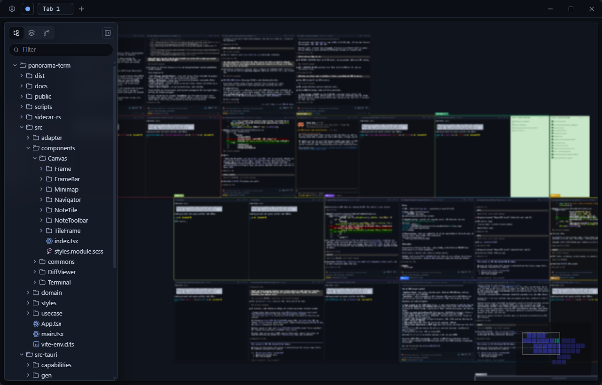

# Panorama



Each terminal is a tile you drag, resize, and park wherever it makes sense. The shells themselves
run in a separate native daemon, not in the app, so closing the window or reloading the UI does not
kill anything - reopen and every session is exactly where you left it.

Early stage, moving fast.

## Run

```sh
bun install
bun run dev
```

Needs Rust and bun. `bun run dev` compiles the Rust PTY daemon, starts it on port 9777, runs Vite,
and opens the Tauri window. An already-running daemon is reused, so a restart reattaches to live
shells instead of respawning them.

`bun run build` produces an installer with the daemon bundled alongside the app.

## How it works

The frontend never emulates a terminal. `sidecar-rs` owns the PTYs: `portable-pty` spawns the
shell, `vt100` does the VT emulation, and each tile holds a WebSocket to it that receives a
ready-to-paint grid frame - a line buffer plus packed per-cell attributes. The tile paints that
straight onto a `<canvas>`, scaled by the zoom level, which is why 20 live terminals on screen stay
cheap. No xterm.js anywhere.

Tiles off screen or shrunk below a minimum width drop their canvas and show a placeholder; the
shell behind them keeps running.

Built with Tauri 2, React 19, Vite, SCSS Modules, and bun. Everything is written to local files.

## Getting around

| Action       | Key                  |
| ------------ | -------------------- |
| New terminal | `Ctrl+T`             |
| New note     | `Ctrl+Shift+N`       |
| Close tile   | `Ctrl+W`             |
| Fullscreen   | `Ctrl+Shift+F`       |
| Reset zoom   | `Ctrl+0`             |
| Navigator    | `Ctrl+B`             |
| Pan / zoom   | Drag canvas / Ctrl+wheel |

All rebindable in Settings.

Besides terminals there are **note** tiles (markdown scratchpad, TipTap) and **code** tiles
(read-only file view, drag a file in from the tree). Related tiles can be boxed into a **frame**
and moved together, and the minimap gets you back to whatever is far off screen.

The sidebar holds the file tree, the tab list, and a git tab: switch branch, stage, commit. Clicking
a changed file opens the diff viewer (`Alt+Arrow` to walk chunks and files).

An agent that finishes work in an off-screen tile raises a toast, so you can leave one running and
go look at another.

## Sidecar protocol

- `GET /health` -> `ok`
- `GET /kill?tileId=...` -> kill a session and its process tree
- `WS /pty?tileId=...&cols=...&rows=...[&cwd=...][&target=...]`
  - in: `{t:"in",d}` / `{t:"resize",cols,rows}` / `{t:"scroll",rows}` / `{t:"kill"}`
  - out: `{t:"ready",cols,rows,reused}` / `{t:"exit"}`, plus binary grid frames

One session per `tileId`, keyed by the daemon, so a reconnect replays the current screen with no
ring buffer. Spawns are throttled by a semaphore so opening a workspace with 30 tiles does not fork
30 shells at once.
